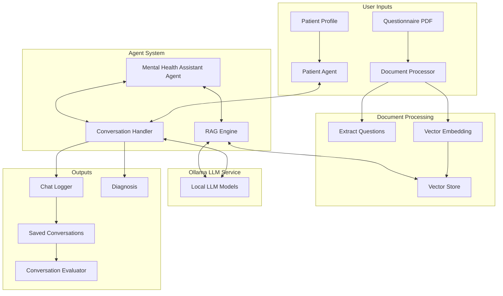

# Mental Health Multi-Agent System

A sophisticated system that simulates mental health assessments using AI agents, with one agent acting as a mental health professional and another simulating a patient with specific psychiatric conditions.

## Table of Contents

- [System Overview](#system-overview)
- [Architecture Diagram](#architecture-diagram)
- [Key Components](#key-components)
- [Installation](#installation)
- [Usage](#usage)
  - [Basic Usage](#basic-usage)
  - [Command-Line Options](#command-line-options)
  - [Batch Processing](#batch-processing)
  - [Viewing Saved Conversations](#viewing-saved-conversations)
  - [Analyzing Batch Results](#analyzing-batch-results)
- [Directory Structure](#directory-structure)
- [How It Works](#how-it-works)
- [Customization Options](#customization-options)
- [Evaluation System](#evaluation-system)
  - [Standard Metrics](#standard-metrics)
  - [Rubric-Based Evaluation](#rubric-based-evaluation)
  - [Running Evaluations](#running-evaluations)
- [Advanced Features](#advanced-features)
- [Troubleshooting](#troubleshooting)

## System Overview

The Mental Health Multi-Agent System is designed to simulate psychiatric assessments by creating a conversation between two specialized AI agents:

1. **Mental Health Assistant**: Uses clinical knowledge to ask questions, interpret responses, and provide a diagnosis based on a questionnaire
2. **Patient**: Responds to questions based on a simulated psychiatric condition profile

The system leverages large language models (LLMs) running locally through Ollama, employs Retrieval-Augmented Generation (RAG) to enhance responses with domain knowledge, and stores conversations for further analysis.

## Architecture Diagram



## Key Components

### 1. Document Processing & RAG

- **PDF Processor**: Extracts questions from questionnaire PDFs
- **Document Processor**: Processes various document types (PDF, TXT, DOCX, JSON)
- **RAG Engine**: Provides relevant context from medical literature
- **Vector Store**: Stores document embeddings for semantic search

### 2. Agent System

- **Mental Health Assistant**: Conducts assessments using predefined questionnaires
- **Patient**: Simulates responses based on selected psychiatric condition profiles
- **Conversation Handler**: Manages the interaction between agents

### 3. Infrastructure

- **Ollama Client**: Interfaces with locally deployed LLMs
- **Chat Logger**: Records conversations and diagnoses
- **Profile System**: Manages different patient profiles

### 4. Analysis Tools

- **Batch Processor**: Generates multiple conversations for research and analysis
- **Batch Analyzer**: Analyzes patterns and statistics across multiple conversations
- **Conversation Evaluator**: Assesses quality and clinical validity of conversations
- **PDF Debugger**: Helps diagnose issues with questionnaire extraction

## Installation

### Prerequisites

- Python 3.8 or higher
- [Ollama](https://ollama.ai/download) installed and running
- Required Python packages (see requirements.txt)

### Setup Steps

1. Clone this repository or download the source code
2. Install required dependencies:

```bash
pip install -r requirements.txt
```

3. Download required models with Ollama:

```bash
# For embeddings (required for RAG):
ollama pull nomic-embed-text

# For the agent models (choose based on your hardware):
ollama pull qwen2.5:3b
# or for larger models with better performance:
# ollama pull llama2:13b
```

4. Create the necessary directories:

```bash
mkdir -p documents chat_logs cache
```

5. Add questionnaire PDFs to the `documents` directory

## Usage

### Basic Usage

Run the application with default settings:

```bash
python main.py
```

This will:
1. Look for questionnaires in the `documents` directory
2. Allow you to select a patient profile
3. Start a conversation between the mental health assistant and patient
4. Generate a diagnosis
5. Save the conversation to the `chat_logs` directory

### Command-Line Options

```bash
# Use a specific questionnaire PDF
python main.py --pdf_path path/to/questionnaire.pdf

# Specify a different document directory
python main.py --docs_dir path/to/docs_folder

# Choose a specific patient profile
python main.py --patient_profile depression

# Use different models for the agents
python main.py --assistant_model llama2:13b --patient_model llama2:13b

# Don't save the conversation log
python main.py --no-save

# Specify a different logs directory
python main.py --logs-dir path/to/logs_folder
```

### Batch Processing

The batch processing feature allows you to generate multiple conversations automatically, which is useful for research, testing, or creating datasets.

```bash
# Generate 5 conversations using the same patient profile
python main.py --batch 5 --patient_profile depression

# Generate 10 conversations with randomized patient profiles
python main.py --batch 10 --randomize-profiles

# Generate 3 conversations and save them to a specific directory
python main.py --batch 3 --logs-dir ./my_batch_results
```

### Viewing Saved Conversations

Use the provided chat viewer:

```bash
python view_chats.py --list
```

### Analyzing Batch Results

After generating a batch of conversations, you can analyze the results to find patterns:

```bash
python analyze_batch.py chat_logs/batch_20231215_120000
```

This will provide:
- Profile distribution statistics
- Analysis of diagnoses across conversations 
- Correlation between patient profiles and diagnoses
- Conversation statistics (length, duration, etc.)

## Directory Structure

```
mental_health_multiagent/
├── main.py                       # Main application entry point
├── agents/                       # Agent implementations
│   ├── mental_health_assistant.py
│   └── patient.py
├── utils/                        # Utility modules
│   ├── conversation_handler.py   # Handles agent interactions
│   ├── chat_logger.py            # Conversation logging
│   ├── document_processor.py     # Document handling
│   ├── ollama_client.py          # LLM interface
│   ├── pdf_processor.py          # PDF extraction
│   ├── rag_engine.py             # RAG functionality
│   ├── vector_store.py           # Vector database
│   ├── batch_processor.py        # Batch conversation processing
│   ├── chat_evaluator.py         # Conversation evaluation
│   ├── ragas_evaluation.py       # Ragas-based evaluation
│   ├── ollama_evaluation.py      # Fallback evaluator
├── prompts/                      # System prompts
│   ├── mental_health_assistant_prompt.txt
│   └── patient_prompt.txt
├── profiles/                     # Patient profiles
│   ├── anxiety.txt
│   ├── bipolar.txt
│   ├── depression.txt
│   ├── ptsd.txt
│   └── schizophrenia.txt
├── rubrics/                      # Evaluation rubrics
│   ├── rubrics.py
├── documents/                    # Reference documents for knowledge retrieval
│   └── questionnaires/           # Questionnaires used for assessment
├── interface/                    # Components for the chat log viewer
├── chat_logs/                    # Saved conversations
├── cache/                        # Embedding cache
├── analyze_batch.py              # Batch analysis tool
├── debug_pdf.py                  # PDF debugging tool
├── create_profile.py             # Patient profile creation tool
└── chat_viewer.py                # Chat log viewer entry point
```

## How It Works

The system functions through the following workflow:

1. **Questionnaire Loading**
   - The system loads one or more questionnaires from PDF files
   - Questions are extracted using text analysis
   - Questions become the structure for the conversation

2. **Patient Profile Selection**
   - A profile is selected that defines the patient's psychiatric condition
   - The profile contains symptoms, history, and response patterns
   - This determines how the patient agent will respond to questions

3. **Document Processing**
   - All documents are processed and split into chunks
   - Embeddings are created for each chunk
   - A vector store allows semantic search for relevant information

4. **Conversation Cycle**
   - The assistant asks questions from the questionnaire
   - The patient responds based on their profile
   - The conversation handler manages this exchange

5. **RAG Enhancement**
   - The RAG engine retrieves relevant information from documents:
     1. Patient responses are summarized into clinical observations using AI
     2. These observations form the basis for a focused RAG query
     3. Documents are retrieved based on semantic similarity to this query
     4. Retrieved documents' content is provided to the assistant for diagnosis generation
   - This improves the quality and relevance of the diagnosis

6. **Diagnosis Generation**
   - After all questions are asked, the assistant generates a diagnosis
   - The diagnosis considers all patient responses
   - RAG provides additional clinical context

7. **Conversation Logging**
   - The entire conversation is saved as JSON and plain text
   - Includes metadata about models and profiles used
   - **Enhanced RAG Metrics**:
     - Document access counts and relevance scores
     - Per-document highest and average relevance scores 
     - Example excerpts showing why documents were retrieved
   - Enables review and analysis of past sessions

8. **Conversation Evaluation**
   - The system can evaluate the quality of conversations
   - Provides metrics on clinical accuracy, empathy, and therapeutic approach
   - Offers quantitative insights into conversation effectiveness

## Customization Options

### Adding New Patient Profiles

Create a new profile file in the `profiles` directory following this format:

```
You are roleplaying as a patient with [DISORDER] seeking mental health assessment. You have the following characteristics:

- [SYMPTOM 1]
- [SYMPTOM 2]
- ...

When answering questions:
- [BEHAVIOR 1]
- [BEHAVIOR 2]
- ...
```

Alternatively, use the provided script:

```bash
python create_profile.py --interactive
```

### Adding Reference Documents and Questionnaires

The system now clearly separates two types of documents:

1. **Questionnaires**: Place assessment questionnaires in the `documents/questionnaires/` directory. These are used to structure the conversation.

2. **Reference Materials**: Place clinical reference materials in the main `documents/` directory. These are used by the RAG system to enhance the assistant's knowledge and improve diagnostic accuracy. Good examples include:
   - DSM-5 excerpts
   - Clinical guidelines
   - Research papers
   - Treatment protocols

This separation makes it easier to manage your documents and ensures that only questionnaires appear in the selection menu when starting an assessment.

### Modifying System Prompts

Edit the files in the `prompts` directory to change the behavior of the agents:
- `mental_health_assistant_prompt.txt`: Controls the assistant's approach
- `patient_prompt.txt`: Default patient behavior (if no profile is selected)

### Customizing Evaluation Rubrics

The system uses customizable rubrics for evaluating conversation quality, stored in `utils/rubrics.py`. You can modify existing rubrics or add new ones to match your specific evaluation needs.

## Evaluation System

The Mental Health Multi-Agent System includes a sophisticated conversation evaluation capability that analyzes the quality, clinical accuracy, and therapeutic approach of the mental health assistant's responses.

### Standard Metrics

The evaluation system can provide several standard metrics when context information is available:

1. **Answer/Response Relevancy** - Measures how directly the assistant's responses address the patient's questions or statements
2. **Faithfulness** - Assesses whether the assistant's responses contain information that is supported by the available context
3. **Context Precision** - Evaluates how relevant the context information is to the patient's questions
4. **Context Recall** - Measures how effectively the assistant incorporates relevant context information in their responses

### Rubric-Based Evaluation

The system also performs specialized mental health evaluation using clinical rubrics:

1. **Empathy & Rapport** - Evaluates how well the responses demonstrate empathy and build rapport with the patient
2. **Clinical Accuracy** - Assesses the clinical accuracy and appropriateness of responses
3. **Therapeutic Approach** - Evaluates the appropriate use of therapeutic techniques 
4. **Safety & Risk Assessment** - Measures how well responses address safety concerns or risk factors
5. **Communication Clarity** - Evaluates the clarity and accessibility of language used

Each rubric uses a 5-point scale with detailed criteria for each level, allowing for nuanced assessment of conversation quality.

### Running Evaluations

You can evaluate conversations in several ways:

1. Launch the chat viewer: `python chat_viewer.py`
2. Open a conversation from the sidebar
3. Select an evaluation model from the dropdown menu
   - The system will automatically detect all available Ollama models on your system
   - Smaller models (like Qwen 3B or Gemma 2B) are preferred for faster evaluation
   - Larger models may provide more detailed analysis but take longer to process
4. Click "Evaluate with Ollama" to begin the evaluation
5. Results will appear in the evaluation panel showing:
   - Overall scores across different evaluation dimensions
   - Detailed explanations for each score
   - Diagnosis accuracy assessment (when applicable)
   - Overall assessment of the conversation quality

### Customizing the Evaluation Model

The evaluation system allows you to choose which locally installed Ollama model to use:

1. Install models via Ollama CLI: `ollama pull model_name`
2. They will automatically appear in the model selection dropdown

If no specific model is selected, the system will default to using qwen2.5:3b for evaluation.

## Advanced Features

### Batch Generation and Analysis

The batch processing system allows you to:

1. Generate multiple conversations automatically
2. Use the same patient profile for all conversations or randomize profiles
3. Save all conversations with metadata for analysis
4. Generate statistical analyses across conversations
5. Compare diagnoses between different patient profiles
6. Identify patterns in the AI's diagnostic approach

This is especially useful for:
- Evaluating the consistency of the mental health assistant
- Creating datasets for research or training
- Testing system performance with different profiles
- Analyzing how different symptoms lead to different diagnoses

### Embedding Model Selection

The system uses `nomic-embed-text` by default for embeddings, but you can modify the `vector_store.py` file to use a different model.

### Chat Log Viewer

The project includes a web-based chat log viewer to easily browse, filter, and analyze your conversations.

#### Installation

If you haven't already, install Flask:

```bash
pip install flask
```

#### Running the Chat Viewer

To launch the chat viewer:

```bash
python chat_viewer.py
```

Additional options:
- `--port`: Specify the port to run the server on (default: 5000)
- `--logs-dir`: Directory containing chat logs (default: ./chat_logs)

#### Usage

1. Open your browser and navigate to http://127.0.0.1:5000
2. You'll see the chat logs listed in the sidebar
3. Use the filters to narrow down the log list:
   - Select a patient profile from the dropdown
   - Choose a date range
   - Enter search terms
4. Click on any log to view the full conversation
5. The diagnosis is shown in a separate panel at the bottom
6. Use the "Export as Text" button to download a text version of the conversation
7. Click "Evaluate with Ollama" to run an automated evaluation of the conversation

### Debugging PDF Extraction

If you're having trouble with PDF question extraction, use the debugging tool:

```bash
python debug_pdf.py path/to/your/questionnaire.pdf
```

This will analyze the PDF and show what text and questions are being extracted.

### Debugging Question Extraction

If you're having issues with questionnaire parsing or want to verify how questions are being extracted from your documents, use the `debug_question_extraction.py` utility:

```bash
python -m utils.debug_question_extraction path/to/your/questionnaire.pdf
```

This will display:
1. Basic document information
2. The first 200 characters of content
3. A list of all extracted questions
4. If no questions were found, the full document content for manual inspection

Example output:

```
Document: documents/questionnaires/dsm5.pdf
Content length: 9843 characters
First 200 characters of content:
DSM-5 Self-Rated Level 1 Cross-Cutting Symptom Measure—Adult

Instructions

For each question below, circle the number that best describes how much (or how often) you have been bothered by each proble

Extracted 23 questions:
1. Little interest or pleasure in doing things?
2. Feeling down, depressed, or hopeless?
...
23. Using any of the following medicines ON YOUR OWN (without a doctor's prescription) in greater amounts or longer than prescribed (e.g., painkillers like Vicodin, stimulants like Ritalin or Adderall, sedatives like sleeping pills or Valium, or drugs such as marijuana, cocaine, crack, ecstasy, hallucinogens, heroin, inhalants, or methamphetamine)?
```

### Troubleshooting Question Extraction

If questions are not being extracted properly:

1. Check if the document is properly formatted with clear question marks
2. Try preprocessing the document (e.g., convert PDF to text)
3. For multi-line questions, ensure they follow standard formatting
4. Run the test suite to verify the extraction logic: `python -m tests.test_question_extraction`

## Troubleshooting

### No Questions Extracted from PDF

- Ensure the PDF contains searchable text (not scanned images)
- Check that questions end with question marks
- Try using the `debug_pdf.py` tool to examine the PDF
- Consider creating a text file with questions instead

### Embedding Errors

- Make sure Ollama is running (`ollama serve`)
- Check that the embedding model is installed (`ollama pull nomic-embed-text`)
- Try using a different embedding model by modifying `vector_store.py`

### Poor Quality Responses

- Try a larger LLM model
- Add more detailed patient profiles
- Provide more comprehensive reference materials in the documents directory
- Adjust the system prompts to be more specific

### Out of Memory Errors

- Use smaller models
- Reduce chunk size in `vector_store.py`
- Limit the number of documents processed

## Understanding RAG Logs

The system now produces comprehensive RAG metrics in conversation logs:

```json
"rag_summary": {
  "total_rag_queries": 5,
  "total_documents_accessed": 12,
  "documents_accessed": {
    "APA_DSM-5-Schizophrenia.pdf": {
      "access_count": 4,
      "highest_score": 0.7449,
      "average_score": 0.6823,
      "example_excerpt": "Schizophrenia The upcoming fifth edition of the Diagnostic and Statistical..."
    },
    "APA_DSM-5-Substance-Use-Disorder.pdf": {
      "access_count": 3,
      "highest_score": 0.7272,
      "average_score": 0.6853,
      "example_excerpt": "Substance-Related and Addictive Disorders In the fifth edition of..."
    }
  }
}
```

This format provides:
- Count of queries where RAG was used
- Total document access instances
- Per-document statistics:
  - Access frequency
  - Highest relevance score achieved
  - Average relevance score
  - Example text showing why the document was deemed relevant

During execution, the system will also display RAG information:

## License

This project is provided as open source software for research and educational purposes.